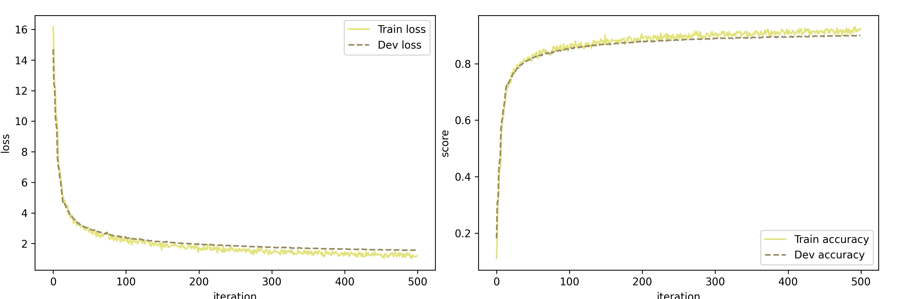
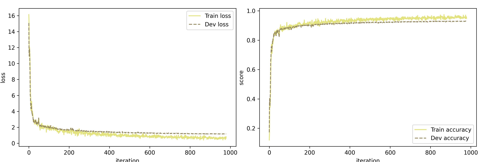
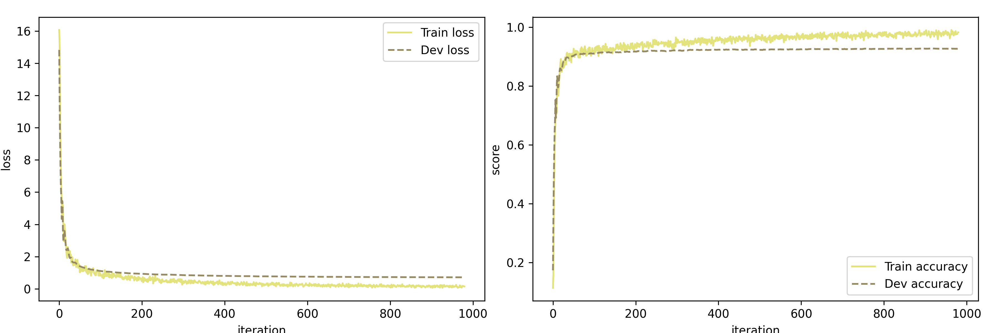
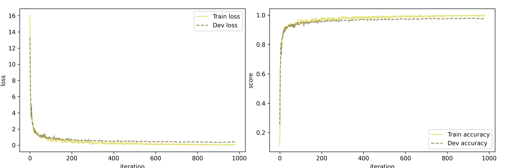
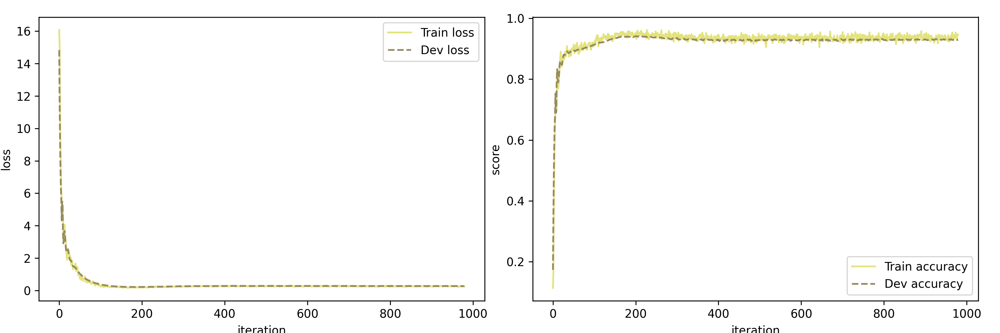
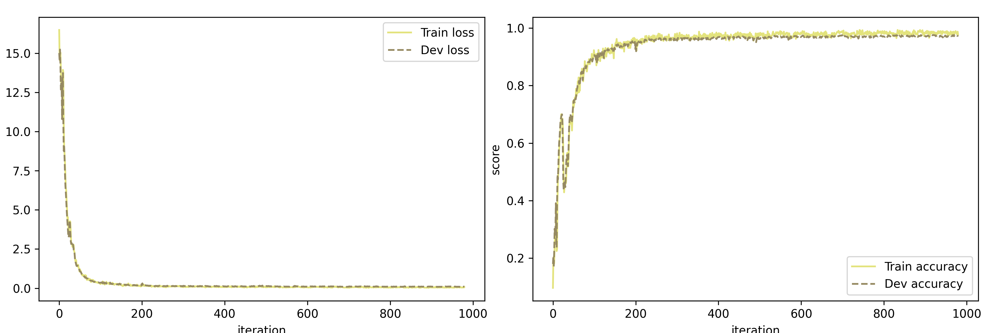
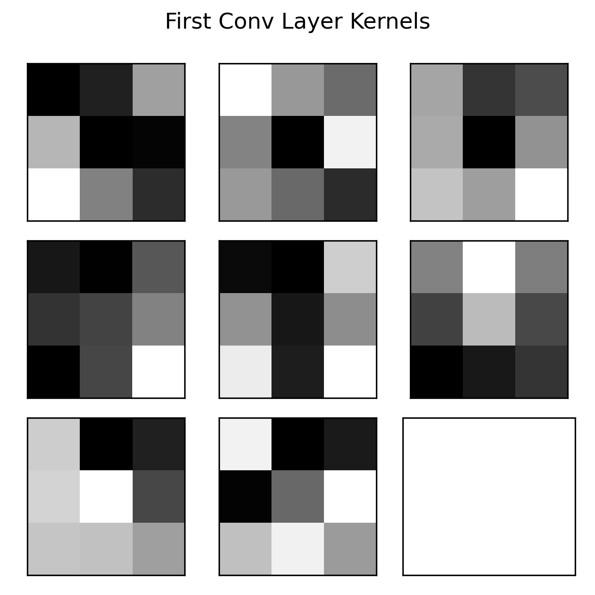

# Project 1

Due: May 1, 2025  
姓名: 雍崔扬  
学号: 21307140051  
Github Repo

## 1. Problem Setting

In this problem we will investigate handwritten digit classification.   
MNIST (Modified National Institute of Standards and Technology database)   
is a large database of handwritten digits commonly used for training various image processing systems.   
The database is also widely used for training and testing in the field of machine learning.   
It was created by "re-mixing" the samples from NIST's original datasets.   
The dataset contains $60,000$ training images and $10,000$ testing images.   
Each image is a $28\times 28$ pixel grayscale image and is labeled with the correct digit ($0\sim9$) it represents.   
You need to implement one or more neural network to recognize the handwritten digit,   
and conduct experiment to test your model and conclude the ability of your model.   
After that, you may implement several modifications to your model and test whether the model acts better.   
Do not worry about whether your mode's performance is better than others',   
the effort you’ve made to improve your model matters.   

Please refer to following instruction of writing the report:

- ① The goal of your write-up is to document the experiments you’ve done and your main findings.   
  So be sure to explain the results.   
  Hand in a single PDF file of your report.   
  Enclose a Github link to your codes in your submitted file.   
  You should also provide a link to your dataset and your trained model weights in your report.   
  You may upload the dataset and model into Google Drive or other Netdisk service platform.   
  Also put the name and Student ID in your paper.   
  Lack of code link or model weights link will lead to a penalization of scores.  
- ② You may use Mindspore to do some visualization   
  or do some experiments if your implemented version runs too slow.  
  But you must implement your own version first.

- ③ Note that the goal of this project is to let the students do the practice,   
  and write some basic components of a neural network or CNN.   
  So do not invoke the deep learning functions/modules   
  that can directly give the results of the following questions (e,g, the PyTorch package).   
  The project is very easy, and you do not really need GPUs;   
  just running it on CPU will be enough.


## 2. Implementation

1. `op.py`   
   You're welcome to implement other complicated layer (e.g.  ResNet Block or Bottleneck)
2. `models.py`   
   You may freely edit or write your own model structure.
3. `mynn/lr_scheduler.py`   
   You may implement different learning rate scheduler in it.
4. `MomentGD` in `optimizer.py`
5. Modifications in `runner.py` if needed   
   when your model structure is slightly different from the given example.

### 2.1 `op.py`

#### (1) `Linear`

Implement the forward and backward function of class `Linear`.

- **① 前向传播:**  
  $$
  X \in \mathbb R^{\text{batch\_size}\times \text{in\_dim}}\\
  W \in \mathbb R^{\text{in\_dim}\times \text{out\_dim}}\\
  b \in \mathbb R^{1\times \text{out\_dim}}\\
  \hline
  Z = X W + 1_{\text{batch\_size}}\cdot b \in \mathbb R^{\text{batch\_size}\times \text{out\_dim}}
  $$

  ```python
  def forward(self, X):
      """
      input: [batch_size, in_dim]
      Weight: [in_dim, out_dim]
      Bias: [1, out_dim]
      output: [batch_size, out_dim]
      """
      self.input = X
      return np.dot(X, self.W) + self.b
  ```

- **② 反向传播:**
  $$
  \text{grads}=\frac{\partial \mathcal L}{\partial Z} \in \mathbb R^{\text{batch\_size}\times \text{out\_dim}}\\
  X \in \mathbb R^{\text{batch\_size}\times \text{in\_dim}}\\
  W \in \mathbb R^{\text{in\_dim}\times \text{out\_dim}}\\
  b \in \mathbb R^{1\times \text{out\_dim}}\\
  \hline
  \frac{\partial \mathcal L}{\partial W} = \frac{\partial Z}{\partial W}\cdot \frac{\partial \mathcal L}{\partial Z} = X^{\mathrm T} \cdot \text{grads}\in \mathbb R^{\text{in\_dim}\times \text{out\_dim}}\\
  
  \frac{\partial \mathcal L}{\partial b} = \frac{\partial Z}{\partial b}\cdot \frac{\partial \mathcal L}{\partial Z} = 1_{\text{batch\_size}}^{\mathrm T} \cdot \text{grads}\in \mathbb R^{1\times \text{out\_dim}}\\
  
  \frac{\partial \mathcal L}{\partial X} = \frac{\partial Z}{\partial X}\cdot \frac{\partial \mathcal L}{\partial Z} = \text{grads}\cdot W^{\mathrm T}\in \mathbb R^{\text{batch\_dim}\times \text{in\_dim}}\\
  $$

  同时我们还可以引入对权重 $W$ 的 $l_2$ 正则化:
  
  ```python
  def backward(self, grads : np.ndarray):
      """
      input: [batch_size, out_dim] the grads passed by the next layer.
      output: [batch_size, in_dim] the grads to be passed to the previous layer.
      This function also calculates the grads for W and b.
      """
      X = self.input
      # Compute gradient for W: X^T @ grads, with possible L2 regularization
      # Gradiant ∂L/∂W = ∂Z/∂W · ∂L/∂Z = Xᵀ · grads
      dW = np.dot(X.T, grads)
      if self.L2_regularization: # L2 regularization
          dW += self.L2_regularization_lambda * self.W
  
      # Compute gradient for b: sum over the batch dimension
      # Gradiant ∂L/∂b = ∂Z/∂b · ∂L/∂Z = 1ᵀ · grads
      db = np.sum(grads, axis=0, keepdims=True)
      
      # Compute gradient for the previous layer: grads @ W^T
      # Gradiant ∂L/∂X = ∂L/∂Z · ∂Z/∂X = grads · Wᵀ
      grads_prev = np.dot(grads, self.W.T)
  
      # Save gradients
      self.grads['W'] = dW
      self.grads['b'] = db
  
      return grads_prev
  ```


#### (2) `CrossEntropyLoss`

Implement the `CrossEntropyLoss`.   
Note that the `Softmax` layer could be included in the `CrossEntropyLoss`.

- **① Softmax 函数:**    
  Softmax 函数可以视为 $\text{argmax}(\cdot)$ 函数的平滑版本 (如果我们认为 $\text{argmax}(\cdot)$ 的输出是 one-hot 向量的话)  
  同时它也可以视为 Sigmoid 函数在高维情况的推广: 
  $$
  \begin{align}
  \text{softmax}(z) 
  &:= \frac{\exp(z)}{1_d^{\mathrm T} \exp(z)} \\
  &=
  \frac{1}{\sum_{i=1}^d \exp(z_i)} 
  \begin{bmatrix}
  \exp(z_1)\\
  \vdots\\
  \exp(z_d)
  \end{bmatrix}
  \end{align}\quad (\forall\ x\in \mathbb R^d)
  $$
  它可以用来表示一个具有 $n$ 个可能取值的离散型随机变量的分布.  
  引入 $\text{batch\_size}$ 后，对于 $X\in \mathbb R^{\text{batch\_size}\times D}$ 计算 $\text{softmax}(X)\in \mathbb R^{\text{batch\_size}\times D}$ 的代码如下:  
  (同时引入了增加数值稳定性的技巧)

  ```python
  def softmax(X):
      """
      Numerically stable softmax function.
      Parameters:
          X: np.ndarray of shape (batch_size, num_classes)
      Returns:
          probs: np.ndarray of shape (batch_size, num_classes), where each row sums to 1
      """
      # Subtract max for numerical stability
      x_max = np.max(X, axis=1, keepdims=True)
      x_exp = np.exp(X - x_max)
      partition = np.sum(x_exp, axis=1, keepdims=True)
      return x_exp / partition
  ```

- **② 前向传播:**
  $$
  \text{labels} = y\in \mathbb R^{\text{batch\_size}}\\
  \text{logits} = X\in \mathbb{R}^{\text{batch\_size} \times D}\\
  \hline
  \text{probs} = \text{softmax}(X) \in \mathbb{R}^{\text{batch\_size} \times D}\\
  \mathcal{L} = -\frac{1}{\text{batch\_size}} \sum_{i=1}^{\text{batch\_size}} \log (\text{probs}_{i, y_i} + \varepsilon) \in \mathbb R
  $$
  其中 $\varepsilon>0$ 是一个小的正数，用于避免出现 $\log(0)$ 的错误.

  ```python
  def forward(self, logits, labels):
      """
      logits: [batch_size, D]
      labels : [batch_size, ]
      This function generates the loss.
      """
      self.labels = labels
      batch_size = logits.shape[0]
      
      if self.has_softmax:
          self.probs = self.softmax(logits)
      else:
          self.probs = logits
      
      # Compute cross-entropy loss with numerical stability
      correct_log_probs = np.log(self.probs[np.arange(batch_size), labels] + 1e-8)
      loss = -np.mean(correct_log_probs)
      
      return loss
  ```

- **③ 反向传播:**
  $$
  \text{labels} = y\in \mathbb R^{\text{batch\_size}}\\
  \text{logits} = X\in \mathbb{R}^{\text{batch\_size} \times D}\\
  \hline
  \text{one\_hot} = [\delta_{y_i,j}] \in \mathbb R^{\text{batch\_size}\times D}\\
  \text{probs} = \text{softmax}(X) \in \mathbb{R}^{\text{batch\_size} \times D}\\
  \mathcal{L} = -\frac{1}{\text{batch\_size}} \sum_{i=1}^{\text{batch\_size}} \log (\text{probs}_{i, y_i} + \varepsilon) \in \mathbb R\\
  \frac{\partial \mathcal{L}}{\partial X} = \frac{1}{\text{batch\_size}} (\text{probs} - \text{one\_hot}) \in \mathbb R^{\text{batch\_size}\times D}
  $$
  其中 $\delta_{i,j}:= \begin{cases}
  1,&\text{if }i=j\\
  0,&\text{otherwise}\end{cases}$ 为 Dirac Delta 函数的一种表示形式.  
  
  ```python
  def backward(self):
      """
      Backward pass to compute gradient of the loss w.r.t. inputs to softmax (logits).
      """
      batch_size = self.probs.shape[0]
      num_classes = self.probs.shape[1]
      labels = self.labels
      
      # Create one-hot encoded labels
      one_hot = np.zeros((batch_size, num_classes))
      one_hot[np.arange(batch_size), labels] = 1.0
      
      if self.has_softmax:
          # Gradient when softmax is included: (probs - one_hot) / batch_size
          self.grads = (self.probs - one_hot) / batch_size
      else:
          # Gradient when softmax is excluded: (-one_hot / (probs + 1e-8)) / batch_size
          self.grads = (-one_hot / (self.probs + 1e-8)) / batch_size
      
      # Propagate the gradient backward through the model
      self.model.backward(self.grads)
  ```


#### (3) `conv2D`

Try to implement `conv2D` with efficiency.

- **① 前向传播:**

  ```python
  def forward(self, X, training=True):
      """
      input X: [batch, in_channels, height, width]
      W : [1, out_channels, in_channels, k_h, k_w]
      """
      self.input = X
      self.X_shape = X.shape
      batch_size, in_channels, height, width = X.shape
      k_h, k_w = self.kernel_size
      stride_h, stride_w = self.stride
      pad_h, pad_w = self.padding
  
      # Pad input
      X_padded = np.pad(X, ((0, 0), (0, 0), (pad_h, pad_h), (pad_w, pad_w)), mode='constant')
      self.X_padded = X_padded
  
      # Compute output dimensions
      height_padded, width_padded = X_padded.shape[2], X_padded.shape[3]
      height_new = (height_padded - k_h) // stride_h + 1
      width_new = (width_padded - k_w) // stride_w + 1
  
      # Initialize output
      output = np.zeros((batch_size, self.out_channels, height_new, width_new))
  
      # Perform convolution
      for b in range(batch_size):
          for out_c in range(self.out_channels):
              for in_c in range(in_channels):
                  for i in range(height_new):
                      for j in range(width_new):
                          h_start = i * stride_h
                          h_end = h_start + k_h
                          w_start = j * stride_w
                          w_end = w_start + k_w
                          window = X_padded[b, in_c, h_start:h_end, w_start:w_end]
                          output[b, out_c, i, j] += np.sum(window * self.W[out_c, in_c])
              output[b, out_c] += self.b[out_c]  # Add bias
  
      # Apply dropout during training
      if training and self.dropout_rate > 0:
          self.dropout_mask = (np.random.rand(*output.shape) > self.dropout_rate) / (1 - self.dropout_rate)
          output *= self.dropout_mask
  
      return output
  ```

- **② 反向传播:**

  ```python
  def backward(self, grad):
      """
      grads : [batch_size, out_channels, height_new, width_new]
      """
      # Apply dropout mask to gradient
      if self.dropout_rate > 0 and self.dropout_mask is not None:
          grad *= self.dropout_mask
  
      X_padded = self.X_padded
      batch_size, out_channels, height_new, width_new = grad.shape
      in_channels = self.in_channels
      k_h, k_w = self.kernel_size
      stride_h, stride_w = self.stride
      pad_h, pad_w = self.padding
  
      # Compute dW
      dW = np.zeros_like(self.W)
      for b in range(batch_size):
          for out_c in range(out_channels):
              for in_c in range(in_channels):
                  for i in range(height_new):
                      for j in range(width_new):
                          h_start = i * stride_h
                          h_end = h_start + k_h
                          w_start = j * stride_w
                          w_end = w_start + k_w
                          window = X_padded[b, in_c, h_start:h_end, w_start:w_end]
                          dW[out_c, in_c] += window * grad[b, out_c, i, j]
  
      # Apply L2 regularization
      if self.L2_regularization:
          dW += self.L2_regularization_lambda * self.W
  
      # Compute db
      db = np.sum(grad, axis=(0, 2, 3))
  
      # Compute dX_padded
      dX_padded = np.zeros_like(X_padded)
      for b in range(batch_size):
          for out_c in range(out_channels):
              for in_c in range(in_channels):
                  for i in range(height_new):
                      for j in range(width_new):
                          h_start = i * stride_h
                          h_end = h_start + k_h
                          w_start = j * stride_w
                          w_end = w_start + k_w
                          kernel = self.W[out_c, in_c]
                          grad_val = grad[b, out_c, i, j]
                          dX_padded[b, in_c, h_start:h_end, w_start:w_end] += kernel * grad_val
  
      # Remove padding to get dX
      dX = dX_padded[:, :, pad_h:X_padded.shape[2]-pad_h, pad_w:X_padded.shape[3]-pad_w]
  
      # Save gradients
      self.grads['W'] = dW
      self.grads['b'] = db
  
      return dX
  ```


#### (4) `ReLU`

**ReLU** (Rectified Linear Unit) 函数定义为 $\text{ReLU}(z)=\max\{0_d,z\}\ (\forall\ z\in \mathbb R^d)$  
它还有两个常用变体:

- **带泄露的 ReLU** (Leaky ReLU) 在输入小于 $0$ 时保持一个很小的梯度 $\gamma$，以避免永远不能被激活.  
  其定义如下:  
  $$
  \text{LeakyReLU}(z) 
  := \max\{0_d,z\} + \beta \min\{0_d,z\}\quad (\forall\ z\in \mathbb R^d)\\
  \text{where }\beta \text{ is a constant}\\
  \Updownarrow\\
  \text{LeakyReLU}_i(z)
  :=
  \begin{cases}
  z_i, & \text{if }z_i>0\\
  \beta z_i,&\text{if }z_i\leq 0
  \end{cases}\quad (i=1,\dots,d)
  $$
  其中 $\beta$ 是一个绝对值很小的常数 (或者说超参)，例如 $\beta=0.01$   
  当 $\beta<1$ 时，它可写成 $\text{LeakyReLU}(z) = \max\{z,\beta z\}$，即一个简单的 $\text{maxout}$ 单元.

- **指数线性单元** (Exponential Linear Unit, ELU) 函数是一个近似零中心化的非线性函数.  
  其定义为:
  $$
  \text{ELU}(z) 
  := \max\{0_d,z\} + \beta (\exp(z)-1_d)\quad (\forall\ z\in \mathbb R^d)\\
  \text{where }\beta \text{ is a constant}\\
  \Updownarrow\\
  \text{ELU}_i(z)
  :=
  \begin{cases}
  z_i, & \text{if }z_i>0\\
  \beta (\exp(z_i)-1),&\text{if }z_i\leq 0
  \end{cases}\quad (i=1,\dots,d)
  $$
  其中 $\beta$ 是一个常数 (或者说超参)，用于调整输出均值在 $0_d$ 附近. 

**Python 实现:**

```python
# ReLU 类激活函数
class ReLU(Layer):
    """
    ReLU 型激活函数, 支持 'relu'、'leaky_relu'、'elu' 三种类型.
    type : {'relu', 'leaky_relu', 'elu'}
        指定激活函数类型.
    alpha : float
        对于 LeakyReLU 和 ELU, 在输入 <=0 时的缩放系数 alpha, 默认为 0.01.
    """
    def __init__(
        self, 
        type: Literal['relu','leaky_relu','elu']='relu', 
        alpha: float = None
    ) -> None:
        super().__init__()
        self.type = type.lower()
        self.input = None      # 用于 backward 时保存 forward 的输入
        self.optimizable = False
        if alpha is not None:
            if self.type == 'relu':
                print("[WARNING] Parameter alpha is redundant.")
                self.alpha = None
            elif self.type in ['leaky_relu', 'elu']:
                self.alpha = alpha
            else:
                raise ValueError(f"Unsupported type of ReLU-type activation: {self.type}")
        else:
            if self.type == 'relu':
                self.alpha = None
            elif self.type == 'leaky_relu':
                self.alpha = 0.01
            elif self.type == 'elu':
                self.alpha = 1
            else:
                raise ValueError(f"Unsupported type of ReLU-type activation: {self.type}")

    def __call__(self, X: np.ndarray) -> np.ndarray:
        return self.forward(X)

    def forward(self, X: np.ndarray) -> np.ndarray:
        """
        前向计算：根据 self.type 选择不同公式.
        relu:       f(x)=max(0, x)
        leaky_relu: f(x)=max(x, alpha*x)
        elu:        f(x)= x                 if x>0
                          alpha*(exp(x)-1)  if x<=0
        """
        self.input = X
        if self.type == 'relu':
            return np.where(X > 0, X, 0)
        elif self.type == 'leaky_relu':
            return np.where(X > 0, X, self.alpha * X)
        elif self.type == 'elu':
            return np.where(X > 0, X, self.alpha * (np.exp(X) - 1))
        else:
            raise ValueError(f"Unsupported type of ReLU-type activation: {self.type}")

    def backward(self, grads: np.ndarray) -> np.ndarray:
        """
        反向传播：根据 self.type 计算导数，再乘以上游梯度 grads = ∂L/∂f.        
        relu':        1 (x>0), 0 (x<=0)
        leaky_relu':  1 (x>0), alpha (x<=0)
        elu':         1 (x>0), alpha*exp(x) (x<=0)
        """
        assert self.input is not None, "Must call forward() before backward()"
        assert grads.shape == self.input.shape
        
        X = self.input
        if self.type == 'relu':
            grad_input = np.where(X > 0, 1, 0)
        elif self.type == 'leaky_relu':
            grad_input = np.where(X > 0, 1, self.alpha)
        elif self.type == 'elu':
            # 对于 ELU，d/dx [alpha*(exp(x)-1)] = alpha * exp(x)
            grad_input = np.where(X > 0, 1, self.alpha * np.exp(X))
        else:
            raise ValueError(f"Unsupported type of ReLU-type activation: {self.type}")
        
        return grad_input * grads
```


#### (5) `Sigmoid`

**Sigmoid 函数** $\sigma(\cdot)$ 的定义如下:
$$
\begin{align}
\sigma(z) 
&:= \frac{1}{1+\exp(-z)}\\
&= \frac{\exp(z)}{\exp(z) + 1}\\
\end{align} \quad (\forall\ z \in \mathbb R)
$$
它把实数域的输入挤压到 $(0,1)$，因此其输出可以直接看作概率分布.    
**双曲正切函数** $\tanh(\cdot)$ 是一种重要的 Sigmoid 型函数，其定义如下:  
$$
\begin{align}
\tanh(z) 
&:= \frac{\sinh(z)}{\cosh(z)}\\ 
&= \frac{e^z-e^{-z}}{e^z+e^{-z}}\\
&= \frac{e^{2z}-1}{e^{2z}+1}\\
&= 2\frac{e^{2z}}{e^{2z}+1} - 1\\
&= 2\sigma(2z)-1
\end{align}
$$
因此双曲正切函数可以视为将 Sigmoid 函数纵向放大 $2$ 倍并将对称中心下移至坐标原点得到的. 

**Python 实现:**

```python
# Sigmoid 型激活函数
class Sigmoid(Layer):
    """
    Sigmoid 型激活函数, 支持 'sigmoid' 和 'tanh' 两种类型.
    type : {'sigmoid', 'tanh'}
        指定激活函数类型.
    threshold: 输入裁剪阈值
    """

    def __init__(
        self, 
        type: Literal['sigmoid','tanh']='sigmoid',
        threshold: float = 20.0
    ) -> None:
        super().__init__()
        self.type = type.lower()
        self.threshold = threshold
        self.output = None     # 保存 output 以便 backward 使用
        self.optimizable = False

    def __call__(self, X: np.ndarray) -> np.ndarray:
        return self.forward(X)

    def forward(self, X: np.ndarray) -> np.ndarray:
        """
        前向计算：根据 self.type 选择不同公式.
        sigmoid:    σ(x) = 1 / (1 + exp(-x))
        tanh:       tanh(x) = (e^x - e^{-x}) / (e^x + e^{-x})
                            = np.tanh(x)
        """
        # 为了数值稳定性 (防止上溢或下溢), 先对 X 做裁剪
        X = np.clip(X, -self.threshold, self.threshold)
        if self.type == 'sigmoid':
            self.output = 1.0 / (1.0 + np.exp(-X))
        elif self.type == 'tanh':
            self.output = np.tanh(X)
        else:
            raise ValueError(f"Unsupported type of Sigmoid-type activation: {self.type}")
        return self.output

    def backward(self, grads: np.ndarray) -> np.ndarray:
        """
        反向传播：根据 self.type 计算导数，再乘以上游梯度 grads = ∂L/∂f.    
        'sigmoid':     dσ/dx = σ(x) * (1 - σ(x))
        'tanh':        dtanh(x)/dx  = 1 - tanh(x)^2
        """
        assert self.output is not None, "Must call forward() before backward()"
        assert grads.shape == self.output.shape

        if self.type == 'sigmoid':
            grad_input = (self.output * (1.0 - self.output))
        elif self.type == 'tanh':
            grad_input = (1.0 - np.square(self.output))
        else:
            raise ValueError(f"Unsupported type of Sigmoid-type activation: {self.type}")

        return grad_input * grads
```


### 2.2 `lr_scheduler.py`

从经验上看，学习率在一开始要保持大些来保证收敛速度，在收敛到最优点附近时要小些以避免来回振荡.  
比较简单的学习率调整策略是**学习率衰减** (learning rate decay)  
学习率衰减可以按每次迭代进行，也可以按每若干次迭代或每个回合进行.  
简单起见，我们这里默认按每次迭代进行，记第 $k$ 轮迭代的学习率为 $\alpha_k$.

#### (1) 分段常数衰减

$$
\alpha_k := \beta_k \alpha_0,\quad\text{ if }k\in [T_k,T_{k+1})\\
\text{where }\{\beta_k\}\text{ is a decreasing sequence within the interval }(0,1)
$$

**Python 实现:**

```python
class PiecewiseConstantLR(Scheduler):
    def __init__(self, optimizer, milestones, gamma_list):
        """
        milestones : list of int
            分段区间端点（左闭右开）, 例如 [100, 200] 表示区间 [0,100), [100,200), [200, ∞)
        gamma_list : list of float
            每个区间内的学习率缩放系数，长度需为 len(milestones) + 1
        """
        super().__init__(optimizer)
        assert len(gamma_list) == len(milestones) + 1, "gamma_list 长度应为 milestones 长度 +1"
        self.milestones = sorted(milestones)
        self.gamma_list = gamma_list
        self.init_lr = optimizer.init_lr  # 保存初始学习率

    def step(self):
        if self.optimizer.warmup_iter > 0 and self.optimizer.warmup_count < self.optimizer.warmup_iter:
            return  # 如果处于 Warmup 期间，则不更新 step_count 和 current_lr
        stage = bisect.bisect_right(self.milestones, self.step_count) # 二分查找对应的小区间
        self.optimizer.current_lr = self.init_lr * self.gamma_list[stage] # 更新当前学习率
        self.step_count += 1
```


#### (2) 逆时衰减

$$
\alpha_k := \alpha_0 \frac{1}{1+\beta k}\\
\text{where }\beta > 0
$$

**Python 实现:**

```python
class InverseTimeLR(Scheduler):
    def __init__(self, optimizer, beta):
        super().__init__(optimizer)
        self.beta = beta
        self.init_lr = optimizer.init_lr  # 保存初始学习率

    def step(self):
        if self.in_warmup():
            return  # 如果处于 Warmup 期间，则不更新 step_count 和 current_lr
        self.optimizer.current_lr = self.init_lr / (1 + self.beta * self.step_count)
        self.step_count += 1
```


#### (3) 指数衰减

$$
\alpha_k := \alpha_0 \beta^k\\
\text{where }0<\beta<1
$$

也可采取以下形式:
$$
\alpha_k := \alpha_0 \exp(-\beta k)\\
\text{where }\beta >0
$$
**Python 实现:**

```python
class ExponentialLR(Scheduler):
    def __init__(self, optimizer, beta=0.999, use_exp=False):
        """
        use_exp : bool
            True 时使用 α = α0 * exp(-beta * step)
            False 时使用 α = α0 * beta^step
        """
        super().__init__(optimizer)
        self.beta = beta
        self.use_exp = use_exp
        self.init_lr = optimizer.init_lr

    def step(self):
        if self.optimizer.warmup_iter > 0 and self.optimizer.warmup_count < self.optimizer.warmup_iter:
            return  # 如果处于 Warmup 期间，则不更新 step_count 和 current_lr
        if self.use_exp:
            self.optimizer.current_lr = self.init_lr * np.exp(-self.beta * self.step_count)
        else:
            self.optimizer.current_lr = self.init_lr * (self.beta ** self.step_count)
        self.step_count += 1
```


#### (4) 余弦衰减 (cosine decay)

$$
\alpha_k := \frac12 \alpha_0 \left(1 + \cos(\frac{k\pi}{\text{max\_iter}})\right)
$$

其中 $\text{max\_iter}$ 是最大迭代次数.  
**Python 实现:**

```python
class CosineAnnealingLR(Scheduler):
    def __init__(self, optimizer, max_iter):
        super().__init__(optimizer)
        self.max_iter = max_iter
        self.init_lr = optimizer.init_lr

    def step(self):
        if self.in_warmup():
            return  # 如果处于 Warmup 期间，则不更新 step_count 和 current_lr
        if self.step_count >= self.max_iter:
            # 超过最大迭代次数后保持一个很小的值
            self.optimizer.current_lr = 1e-2 * self.init_lr # TODO: 不过可能不够灵活
        else:
            cosine = np.cos(np.pi * self.step_count / self.max_iter)
            self.optimizer.current_lr = 0.5 * self.init_lr * (1 + cosine)
        self.step_count += 1
```


#### (5) 学习率预热

在刚开始训练时，由于参数是随机初始化的，梯度往往也比较大，  
再加上比较大的初始学习率，会使得训练不稳定.  
为了提高训练稳定性，我们可以在最初几轮迭代时，采用比较小的学习率，  
等梯度下降到一定程度后再恢复到初始的学习率，这种方法称为**学习率预热** (learning rate warmup)  
在预热过程中，每次更新的学习率为:
$$
\alpha_k := \frac{k}{\text{warm\_up\_iter}} \alpha_0\\
\text{where }1\leq k\leq \text{warm\_up\_iter}
$$
当预热过程结束，再选择一种学习率衰减方法来逐渐降低学习率.  
Python 实现嵌入在 `code/mynn/optimizer.py` 的 `SGD` 方法中.


#### (6) AdaGrad 算法

在标准的梯度下降法中，每个参数在每次迭代时都使用相同的学习率.  
这似乎有些不太合理，因此我们可以根据不同参数的收敛情况分别设置学习率.  
**AdaGrad 算法** (Adaptive Gradient Algorithm) 在每轮迭代自适应地调整每个参数的学习率.  
在第 $k$ 次迭代时，先计算每个参数梯度平方的累计值:
$$
\text{sum}_k:= \text{sum}_{k-1} + g^{(k)}\odot g^{(k)} = \sum_{t=1}^k g^{(t)}\odot g^{(t)}\\
\text{where }\odot \text{ denotes element-wise (Hadamard) multiplication}
$$
第 $k$ 次迭代的迭代格式为:
$$
\theta_k := \theta_k - \frac{\alpha}{\sqrt{\text{sum}_k + \varepsilon}} \odot g^{(k)}
$$
其中 $\alpha>0$ 是初始学习率向量，$\varepsilon>0$ 是为避免零除而设置的小常数 ($1\times 10^{-10}\sim 1\times 10^{-7}$)   
这里的开方、除、加运算都是逐元素进行的操作.

在 AdaGrad 算法中，如果某个参数的偏导数累积比较大，则其学习率相对较小;  
如果其偏导数累积较小，则其学习率相对较大.  
但整体是随着迭代次数的增加，学习率逐渐缩小.   
其缺点是在经过一定次数的迭代依然没有找到最优点时，由于这时的学习率已经非常小，很难再继续找到最优点.


#### (7) RMSprop 算法

RMSprop 算法在某些情况下避免 AdaGrad 算法中学习率不断单调下降以至于过早衰减的缺点.  
在第 $k$ 次迭代时，它首先计算每个参数梯度平方的指数衰减移动平均:
$$
\begin{align}
\text{sum}_k
&:=
\beta \text{sum}_{k-1} 
+
(1-\beta) g^{(k)}\odot g^{(k)}\\
&=
(1-\beta) \sum_{t=1}^k \beta^{k-t} g^{(t)}\odot g^{(t)}
\end{align}
$$
其中 $\beta$ 为衰减率，一般取 $\beta = 0.9$，其余设置与 AdaGrad 算法相同.  
从上式可以看出，RMSProp 算法和 AdaGrad算法 的区别在于 $\text{sum}_k$ 的计算由累积方式变成了指数衰减移动平均.  
在迭代过程中，每个参数的学习率既可以变小也可以变大，并不是呈单调衰减趋势.  
Python 实现嵌入在 `code/mynn/optimizer.py` 的 `SGD` 方法中.


### 2.3 `optimizer.py`

#### (1) 随机梯度下降

记深度神经网络为 $f(x;\theta)$，损失函数为 $\mathcal L(y,f(x;\theta))$，其中 $\theta$ 为网络参数.  
记第 $k$ 轮迭代的网格参数为 $\theta^{(k-1)}$  
我们每次选取 $\text{batch\_size}$ 个训练样本，记第 $k$ 轮迭代选取的样本为 $\mathcal S_k:= \{(x^{(i_j)},y^{(i_j)})\}_{j=1}^{\text{batch\_size}}$   
于是第 $k$ 轮损失函数关于 $\theta$ 的梯度为:
$$
g^{(k)} := \frac{1}{\text{batch\_size}} \sum_{(x,y)\in \mathcal S_k} \frac{\partial \mathcal L(y,f(x;\theta^{(k-1)}))}{\partial \theta}
$$
则第 $k$ 轮参数的迭代格式为:  
$$
\theta^{(k)} = \theta^{(k-1)} - \alpha_k g^{(k)}
$$
其中 $\alpha_k>0$ 是第 $k$ 轮的学习率.


#### (2) 动量法 & Adam 算法

**动量法** (momentum method) 是用之前积累动量来替代真正的梯度.  
每次迭代的梯度可以看作加速度.  
在第 $k$ 次迭代时，计算负梯度的 "加权移动平均" 作为参数的更新方向:
$$
\Delta \theta_k := \rho \Delta \theta_{k-1} - \alpha_k g^{(k)} = -\sum_{t=1}^k \alpha_t \rho^{k-t} g^{(t)}
$$
其中动量因子 $\rho$ 通常设为 $0.9$，$\alpha_k$ 为第 $k$ 轮的学习率.  

- 如果 $\alpha_k \equiv \alpha$，则是经典的动量法.
- 如果 $\alpha_k$ 根据 RMSprop 算法生成，则称为 Adam 算法.

每个参数的实际更新差值取决于最近一段时间内梯度的加权平均值.   
当某个参数在最近一段时间内的梯度方向不一致时，其真实的参数更新幅度变小;  
当在最近一段时间内的梯度方向都一致时，其真实的参数更新幅度变大，起到加速作用.  
一般而言，在迭代初期，梯度方向都比较一致，动量法会起到加速作用，可以更快地到达最优点.  
在迭代后期，梯度方向会不一致，在收敛值附近振荡，动量法会起到减速作用，增加稳定性.  


#### (3) Nesterov 动量法 & Nadam 算法

Nesterov 对动量法进行了改进.  
动量法的迭代格式可以写为:
$$
g^{(k)} := \frac{1}{\text{batch\_size}} \sum_{(x,y)\in \mathcal S_k} \frac{\partial \mathcal L(y,f(x;\theta^{(k-1)}))}{\partial \theta}\\
\hat \theta := \theta^{(k-1)} + \rho \Delta \theta^{(k-1)}\\
\theta^{(k)} := \hat \theta - \alpha_k g^{(k)}
$$
其中 $\mathcal S_k$ 是第 $k$ 轮选取的小批量样本集.  
注意到 $g^{(k)}$ 是根据 $\theta^{(k-1)}$ 计算的，但更合理的选择是根据 $\hat \theta$ 计算.  
因此我们可以将迭代格式调整为:
$$
\hat \theta := \theta^{(k-1)} + \rho \Delta \theta^{(k-1)}\\
g^{(k)} := \frac{1}{\text{batch\_size}} \sum_{(x,y)\in \mathcal S_k} \frac{\partial \mathcal L(y,f(x;\hat \theta))}{\partial \theta}\\
\theta^{(k)} := \hat \theta - \alpha_k g^{(k)}
$$
其中 $\alpha_k$ 为第 $k$ 轮的学习率.

- 如果 $\alpha_k \equiv \alpha$，则是经典的 Nesterov 动量法.
- 如果 $\alpha_k$ 根据 RMSprop 算法生成，则称为 Nadam 算法.

*****

**Python 实现:**

```python
class SGD(Optimizer):
    """
    随机梯度下降优化器, 支持:
      - regular
      - momentum
      - nesterov
      - adam  (RMSprop lr + momentum)
      - nadam (RMSprop lr + Nesterov)
    并集成了线性 Warmup。

    参数
    ----
    model : 模型实例
        需要有 model.layers, 每层需提供 .params (dict)、.grads (dict) 和 .optimizable (bool)
    init_lr : float
        初始学习率
    type: {'regular','momentum','nesterov','adam','nadam'}
        指定优化器类型.
    rho : float, optional
        动量因子 (仅对 momentum/nesterov/adam/nadam 有效)
    beta : float, default=0.9
        RMSprop 的衰减率 (仅对 adam/nadam 有效)
    epsilon : float, default=1e-8
        防止除 0 (仅对 adam/nadam 有效)
    warmup_iter : int, default=0
        线性预热的迭代步数 (0 表示不做预热)
    """
    def __init__(
        self,
        model,
        init_lr: float,
        type: Literal['regular','momentum','nesterov','adam','nadam']='regular',
        rho: float = None,            # 用于 momentum/Nesterov/adam/nadam
        beta: float = 0.9,            # 用于 Adam/Nadam 的 RMSprop 权重
        epsilon: float = 1e-8,        # 防止除零
        warmup_iter: int = 0
    ):
        super().__init__(model, init_lr)
        self.type = type.lower()

        # Warmup 相关
        self.warmup_iter  = warmup_iter
        self.warmup_count = 0

        # —— 为所有需要动量的分支初始化 rho 和 velocity —— 
        if self.type in ['momentum','nesterov','adam','nadam']:
            self.rho = rho if rho is not None else 0.9
            # 每层每个参数都要有一个 velocity
            self.velocity = {
                id(layer): {k: np.zeros_like(v) 
                        for k,v in layer.params.items()}
                for layer in self.model.layers if layer.optimizable
            }
            # —— 为 Adam/Nadam 初始化 RMSprop 累积项 —— 
            if self.type in ['adam','nadam']:
                self.beta    = beta
                self.epsilon = epsilon
                self.sum_grad_sq = { # 保存梯度平方的指数加权平均
                    layer: {k: np.zeros_like(v)
                            for k,v in layer.params.items()}
                    for layer in self.model.layers if layer.optimizable
                }
        # regular 分支不需要 rho
        elif self.type == 'regular':
            if rho is not None:
                print("[WARNING] Parameter rho is redundant for regular SGD.")
            self.rho = None

        else:
            raise ValueError(f"Unsupported optimizer type: {self.type}")

        # 全局 current_lr 仅供 regular/momentum/nesterov 使用
        self.current_lr = init_lr

    def zero_grad(self):
        for layer in self.model.layers:
            if layer.optimizable:
                for k in layer.grads:
                    layer.grads[k].fill(0)

    def step(self):
        # —— 计算本步的 base_lr （线性 Warmup 或外部 scheduler 更新后的 lr） —— 
        if self.warmup_iter > 0 and self.warmup_count < self.warmup_iter:
            self.warmup_count += 1
            base_lr = self.init_lr * (self.warmup_count / self.warmup_iter)
        else:
            base_lr = self.current_lr        
        
        # —— 统一遍历所有可训练层和参数 —— 
        for layer in self.model.layers:
            if not layer.optimizable:
                continue

            for key in layer.params.keys():
                g = layer.grads[key].copy()

                # —— regular SGD —— 
                if self.type == 'regular':
                    layer.params[key] -= base_lr * g
                    continue

                # —— 其它都需要 velocity —— 
                v_prev = self.velocity[id(layer)][key]

                # —— 若是 Adam/Nadam，还要先算 RMSprop 样的 lr_t —— 
                if self.type in ['adam','nadam']:
                    # 更新指数加权平方梯度
                    self.sum_grad_sq[layer][key] = (
                        self.beta * self.sum_grad_sq[layer][key] 
                        + (1 - self.beta) * (g * g)
                    )
                    # per-parameter 学习率
                    lr_t = base_lr / (np.sqrt(self.sum_grad_sq[layer][key]) + self.epsilon)
                else:
                    # momentum/nesterov 用全局 lr
                    lr_t = base_lr

                # —— 计算新的动量 v_t = ρ v_{t-1} - lr_t * g —— 
                v_new = self.rho * v_prev - lr_t * g
                self.velocity[id(layer)][key] = v_new

                # —— 根据 type 做参数更新 —— 
                if self.type in ['momentum','adam']: # 动量修正的 SGD
                    # 直接把动量加上去, θ ← θ + Δθ_k
                    layer.params[key] += v_new

                elif self.type in ['nesterov', 'nadam']: # 近似 Nesterov 动量修正的 SGD
                    # θ_lookahead = θ + ρ Δθ_{k-1}
                    # θ ← θ_lookahead - α g^{(k)}
                    layer.params[key] += self.rho * v_prev - lr_t * g
                else:
                    raise ValueError(f"Unsupported type of SGD optimizer: {self.type}")
```


### 2.4 `model.py`

#### (1) MLP

```python
class ModelMLP(Layer):
    """
    多层感知机模型 (MLP)，网络结构由 size_list 定义，
    激活函数通过 act_func 决定 (支持 'relu'、'sigmoid'、'tanh')。
    支持 L2 正则化 (L2_regularization)。
    """
    def __init__(
        self,
        size_list: List[int] =[784, 600, 10],
        act_func: Literal['relu', 'leaky_relu', 'elu', 'sigmoid','tanh'] = 'relu',
        lambda_list: List[float] = None
    ):
        super().__init__()  # 初始化父类 Layer
        assert len(size_list) >= 2, "size_list 至少包含输入和输出两个维度"
        self.size_list = size_list
        self.act_func = act_func.lower()
        self.layers = []

        if lambda_list is not None:
            assert len(lambda_list) == len(size_list) - 1, (
                "lambda_list 的长度应为 Linear 层数，即 len(size_list) - 1"
            )

        # 搭建全连接 + 激活层
        for i in range(len(size_list)-1):
            in_dim, out_dim = size_list[i], size_list[i+1]
            # Linear 层
            lin = Linear(
                in_dim=in_dim,
                out_dim=out_dim,
                L2_regularization = (lambda_list is not None),
                L2_regularization_lambda = (lambda_list[i] if lambda_list else 0.0)
            )
            self.layers.append(lin)

            # 如果不是最后一层，则插入激活层
            if i < len(size_list)-2:
                if self.act_func in ['relu','leaky_relu','elu']:
                    self.layers.append(ReLU(type=self.act_func))
                elif self.act_func in ['sigmoid', 'tanh']:
                    self.layers.append(Sigmoid(type=self.act_func))
                else:
                    raise ValueError(f"Unsupported type of activation function: {self.act_func}")

    def __call__(self, X: np.ndarray) -> np.ndarray:
        return self.forward(X)

    def forward(self, X: np.ndarray) -> np.ndarray:
        out = X
        for layer in self.layers:
            out = layer(out)
        return out

    def backward(self, loss_grad: np.ndarray) -> np.ndarray:
        grad = loss_grad
        # 逆序传递梯度
        for layer in reversed(self.layers):
            grad = layer.backward(grad)
        return grad
```


#### (2) CNN

```python
class ModelCNN(Layer):
    """
    通用 CNN 模型：
      - input_shape: (in_channels, H, W)
      - conv_channels: 每个卷积层输出通道列表
      - kernel_sizes:  每个卷积层的卷积核大小列表
      - pool_sizes:    每个卷积层后的池化窗口大小列表
      - fc_sizes:      展平后全连接层的输出维度列表（最后一个通常是类别数）
      - act_func:      激活函数类型 ('relu','leaky_relu','elu','sigmoid','tanh')
      - lambda_conv:   每个卷积层的 L2 正则化系数列表（可选）
      - lambda_fc:     每个全连接层的 L2 正则化系数列表（可选）
    """
    def __init__(
        self,
        input_shape: Tuple[int,int,int]=(1, 28, 28),
        conv_channels: List[int]=[8],
        kernel_sizes:  List[int]=[3, 3],
        pool_sizes:    List[int]=[2, 2],
        fc_sizes:      List[int]=[128, 10],
        act_func:      Literal['relu','leaky_relu','elu','sigmoid','tanh']='relu',
        lambda_conv:   List[float]=[1e-4],
        lambda_fc:     List[float]=[1e-4, 0.0]
    ):
        super().__init__()
        C0, H, W = input_shape
        self.act_func = act_func.lower()

        # 验证激活函数类型
        valid_acts = ['relu','leaky_relu','elu','sigmoid','tanh']
        if self.act_func not in valid_acts:
            raise ValueError(f"Unsupported activation function: {self.act_func}")

        # 默认正则系数为 0
        if lambda_conv is None:
            lambda_conv = [0.0]*len(conv_channels)
        if lambda_fc is None:
            lambda_fc = [0.0]*len(fc_sizes)

        # 1) 卷积 + 激活 + 池化
        self.conv_blocks = []
        curr_C, curr_H, curr_W = C0, H, W
        for out_ch, k, p, lam in zip(conv_channels, kernel_sizes, pool_sizes, lambda_conv):
            pad = k // 2
            conv = conv2D(
                in_channels=curr_C, out_channels=out_ch,
                kernel_size=k, stride=1, padding=pad,
                L2_regularization=(lam>0),
                L2_regularization_lambda=lam
            )
            self.conv_blocks.append(conv)

            # 插入激活层
            if self.act_func in ['relu','leaky_relu','elu']:
                self.conv_blocks.append(ReLU(type=self.act_func))
            else:
                # sigmoid 或 tanh
                self.conv_blocks.append(Sigmoid(type=self.act_func))

            # 池化层
            self.conv_blocks.append(MaxPooling(kernel_size=p, stride=p))

            # 计算下一个 feature map 大小
            h1 = (curr_H + 2*pad - k)//1 + 1
            w1 = (curr_W + 2*pad - k)//1 + 1
            curr_H = (h1 - p)//p + 1
            curr_W = (w1 - p)//p + 1
            curr_C = out_ch

        # 2) 全连接层
        flat_dim = curr_C * curr_H * curr_W
        self.fc_blocks = []
        dims = [flat_dim] + fc_sizes
        for i in range(len(dims)-1):
            lam = lambda_fc[i]
            lin = Linear(
                in_dim=dims[i], out_dim=dims[i+1],
                L2_regularization=(lam>0),
                L2_regularization_lambda=lam
            )
            self.fc_blocks.append(lin)

            # 最后一层不加激活
            if i < len(dims)-2:
                if self.act_func in ['relu','leaky_relu','elu']:
                    self.fc_blocks.append(ReLU(type=self.act_func))
                else:
                    self.fc_blocks.append(Sigmoid(type=self.act_func))

        # 用于 backward 恢复形状
        self._flatten_shape = None

        # 卷积层 + 全连接层
        self.layers = self.conv_blocks + self.fc_blocks

    def __call__(self, X):
        return self.forward(X)

    def forward(self, X: np.ndarray) -> np.ndarray:
        out = X
        for layer in self.conv_blocks:
            out = layer.forward(out)
        # 记录形状并展平
        self._flatten_shape = out.shape
        batch = out.shape[0]
        out = out.reshape(batch, -1)
        for layer in self.fc_blocks:
            out = layer.forward(out)
        return out

    def backward(self, loss_grad: np.ndarray) -> np.ndarray:
        grad = loss_grad
        # 全连接反向
        for layer in reversed(self.fc_blocks):
            grad = layer.backward(grad)
        # 恢复到卷积前的四维
        grad = grad.reshape(self._flatten_shape)
        # 卷积反向
        for layer in reversed(self.conv_blocks):
            grad = layer.backward(grad)
        return grad
```


## 3. Questions

Below are additional features you could try to incorporate into your neural network   
to improve performance (the options are approximately in order of increasing difficulty).   
The modifications you make in trying to improve performance are up to you   
and you can even try things that are not on the question list.   
But, let's stick with neural networks models and only use one neural network (no ensembles).   
Remember to write in your reports about what modifications you’ve made and the effectiveness of the modification.

### README

本项目的实验结果:

- 模型文件存放在 `code/saved_models` 路径下
- 训练日志文件存放在 `code/log` 路径下  
  训练历史绘图存放在 `code/figs` 路径下

### Question 1

Change the network structure:   
the vector `nHidden` specifies the number of hidden units in each layer.

**Solution:**      
**实验结果表明适当增加隐藏层的神经元数量，可以提升神经网络的拟合能力.**  
公共配置:

```python
# 随机梯度下降
optimizer = SGD(init_lr=0.1, model=model, type='regular')
# 学习率指数衰减
scheduler = ExponentialLR( 
    optimizer=optimizer,
    beta=0.999,
    use_exp=False
)

batch_size = 1024
num_epoch = 20
```

- **配置一:** (`code/saved_models/best_model_1.pickle`)

  ```python
  model = ModelMLP(
      size_list=[784, 600, 10],        # 输入层 784，隐藏层 600，输出层 10
      act_func='relu'                  # 使用 ReLU 激活函数
  )
  ```

  在验证集上的准确率为 $89.98\%$，在测试集上的准确率为 $90.50\%$.

  

- **配置二:** (`code/saved_models/best_model_2.pickle`)

  ```python
  model = ModelMLP(
      size_list=[784, 2048, 10],        # 输入层 784，隐藏层 2048，输出层 10
      act_func='relu'                   # 使用 ReLU 激活函数
  )
  ```

  在验证集上的准确率为 $92.92\%$，在测试集上的准确率为 $92.92\%$.

  


### Question 2

Change the training procedure by modifying the sequence of step-sizes   
or using different step-sizes for different variables.

**Solution:**   
**实验结果表明 $\text{Adam}$ 和 $\text{Nadam}$ 使用的 $\text{RMSprop}$ 自适应学习率调整策略要显著优于指数学习率衰减.**  
公共配置:

```python
model = ModelMLP(
    size_list=[784, 600, 10],        # 输入层 784，隐藏层 600，输出层 10
    act_func='relu'                  # 使用 ReLU 激活函数
)

batch_size = 1024
num_epoch = 20
```

- **① 动量法** (`code/saved_models/best_model_3.pickle`)

  ```python
  # 动量修正的随机梯度下降
  optimizer = SGD(init_lr=0.1, model=model, type='momentum')
  # 学习率指数衰减
  scheduler = ExponentialLR( 
      optimizer=optimizer,
      beta=0.999,
      use_exp=False
  )
  ```

  在验证集上的准确率为 $92.69\%$，在测试集上的准确率为 $92.67\%$.

  

- **② Nesterov 动量法** (`code/saved_models/best_model_4.pickle`)

  ```python
  # Nesterov 动量修正的随机梯度下降
  optimizer = SGD(init_lr=0.1, model=model, type='nesterov')
  # 学习率指数衰减
  scheduler = ExponentialLR( 
      optimizer=optimizer,
      beta=0.999,
      use_exp=False
  )
  ```

  在验证集上的准确率为 $92.69\%$，在测试集上的准确率为 $92.67\%$.

  

- **③ Adam 法** (`code/saved_models/best_model_5.pickle`)

  ```python
  # RMSprop 动态学习率调整 + 动量修正的随机梯度下降
  optimizer = SGD(init_lr=0.01, model=model, type='adam')
  ```

  在验证集上的准确率为 $97.79\%$，在测试集上的准确率为 $97.89\%$.

  

- **④ Nadam 法** (`code/saved_models/best_model_6.pickle`)

  ```python
  # RMSprop 动态学习率调整 + Nesterov 动量修正的随机梯度下降
  optimizer = SGD(init_lr=0.01, model=model, type='nadam')
  ```

  在验证集上的准确率为 $97.79\%$，在测试集上的准确率为 $97.89\%$.

  


### Question 3

Try some regularization methods.   
(Say, $l_2$ regularization, dropout, early stopping or other methods).   
Does they improve the model performance on validation set or test set?

**Solution:**  
**实验结果表明 $l_2$ 正则化能够提高神经网络在验证集和训练集上的表现.**  
公共配置:

```python
# 动量修正的随机梯度下降
optimizer = SGD(init_lr=0.1, model=model, type='momentum')
# 学习率指数衰减
scheduler = ExponentialLR( 
    optimizer=optimizer,
    beta=0.999,
    use_exp=False
)

batch_size = 1024
num_epoch = 20
```

- **① 无 $l_2$ 正则化** (`code/saved_models/best_model_3.pickle`)

  ```python
  model = ModelMLP(
      size_list=[784, 600, 10],        # 输入层 784，隐藏层 600，输出层 10
      act_func='relu'                  # 使用 ReLU 激活函数
  )
  ```

  在验证集上的准确率为 $92.69\%$，在测试集上的准确率为 $92.67\%$.

  

- **② 有 $l_2$ 正则化** (`code/saved_models/best_model_7.pickle`)

  ```python
  model = ModelMLP(
      size_list=[784, 600, 10],        # 输入层 784，隐藏层 600，输出层 10
      act_func='relu',                 # 使用 ReLU 激活函数
      lambda_list=[1e-2, 1e-2]         # 对每个 Linear 层使用 L2 正则
  )
  ```

  在验证集上的准确率为 $93.87\%$，在测试集上的准确率为 $94.43\%$.

  


### Question 4

Implement the cross entropy loss.   
And incorporate a softmax (multinomial logistic) layer at the end of the network   
so that the 10 outputs can be interpreted as probabilities of each class.

**Solution:**  
已经在 $2.1(2)$ 中实现了，不再赘述.


### Question 5

Implement the Conv2D operator on your own.   
And modify your Multi-Layer Perceptron into a CNN.

**Solution:**  
已经在 $2.1(3)$ 中实现了，不再赘述.    
模型配置: (`code/saved_models/best_model_8.pickle`)

```python
model = ModelCNN(
    input_shape   = (1, 28, 28),
    conv_channels = [8],            # 卷积层输出通道
    kernel_sizes  = [3, 3],         # 卷积核 3×3
    pool_sizes    = [2, 2],         # 池化窗口 2×2
    fc_sizes      = [128, 10],      # 全连接层：128 → 10
    act_func      = 'relu',         # 激活：ReLU
    lambda_conv   = [1e-4],   		# 卷积层的 L2 正则
    lambda_fc     = [1e-4, 0.0]     # 全连接层 L2: 只对第一层作用
)

# 优化器 SGD + 动态学习率调整
optimizer = SGD(init_lr=0.01, model=model, type='adam')
scheduler = ExponentialLR(
    optimizer=optimizer,
    beta=0.999,
    use_exp=False
)

batch_size = 1024
num_epoch = 20
```

在验证集上的准确率为 $97.48\%$，在测试集上的准确率为 $97.42\%$.




### Question 6

You can artificially create more training examples,   
by applying small transformations (translations, rotations, resizing, etc.) to the original images.   
But do not use other datasets.

**Solution:**  
简单起见，我们采用旋转进行数据增广，提升卷积神经网络识别倾斜数字的稳健性.

```python
def rotate_images(X, angles):
    """
    将 X 中的每张图像按 angles 列表中的角度旋转,
    返回一个新的大数组, shape = (len(angles)*N, 1, H, W)
    """
    X = X.reshape(-1, 1, 28, 28)
    B, C, H, W = X.shape
    all_imgs = [X]  # 原始不动
    for a in angles:
        aug = np.empty_like(X)
        for i in range(B):
            arr = (X[i,0] * 255).astype(np.uint8)
            pil = Image.fromarray(arr, mode='L')
            pil2 = pil.rotate(a)
            aug[i,0] = np.array(pil2, dtype=np.float32) / 255.0
        all_imgs.append(aug)
    # 垂直拼接
    X = np.concatenate(all_imgs, axis=0)
    X = X.reshape(-1, 28*28)
    return X
```

模型配置: (`code/saved_models/best_model_8.pickle`)

```python
model = ModelCNN(
    input_shape   = (1, 28, 28),
    conv_channels = [8],            # 卷积层输出通道
    kernel_sizes  = [3, 3],         # 卷积核 3×3
    pool_sizes    = [2, 2],         # 池化窗口 2×2
    fc_sizes      = [128, 10],      # 全连接层：128 → 10
    act_func      = 'relu',         # 激活：ReLU
    lambda_conv   = [1e-4],   		# 卷积层的 L2 正则
    lambda_fc     = [1e-4, 0.0]     # 全连接层 L2: 只对第一层作用
)

# 优化器 SGD + 动态学习率调整
optimizer = SGD(init_lr=0.01, model=model, type='adam')
scheduler = ExponentialLR(
    optimizer=optimizer,
    beta=0.999,
    use_exp=False
)

batch_size = 1024
num_epoch = 10
```


### Question 7

Visualize your model weights (especially the convolution kernels) and see if you can read out something.

**Solution:**  
我们使用 `code/weight_visualization.py`   
可视化 `code/saved_models/best_model_8.pickle` 卷积层 $(1,8,3,3)$ 的权重:



- 这 $8$ 个 $3\times 3$ 卷积核呈现不同的模式，说明训练过程中未出现核退化的现象，即所有核均被有效利用.
- 部分核 (如第 $(2,1)$ 和 $(2,3)$ 个核) 权重分布均匀，可能负责捕捉低频信息 (如背景)，  
  而高对比度核 (如第 $(2,2)$ 个核) 则关注高频细节 (如笔画边缘)

**The End**
